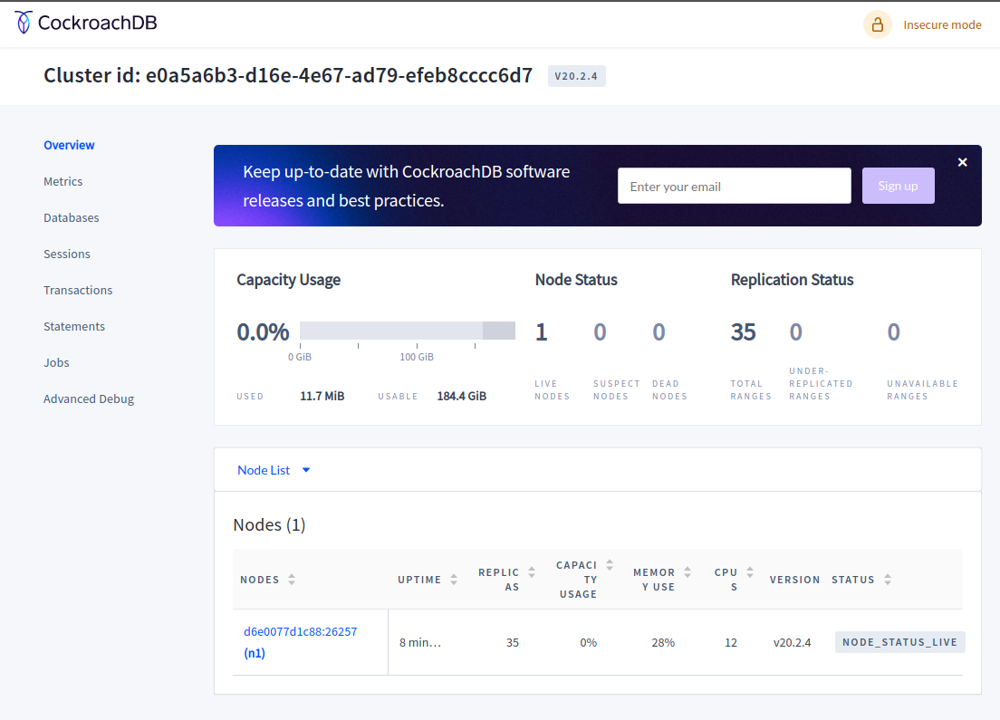
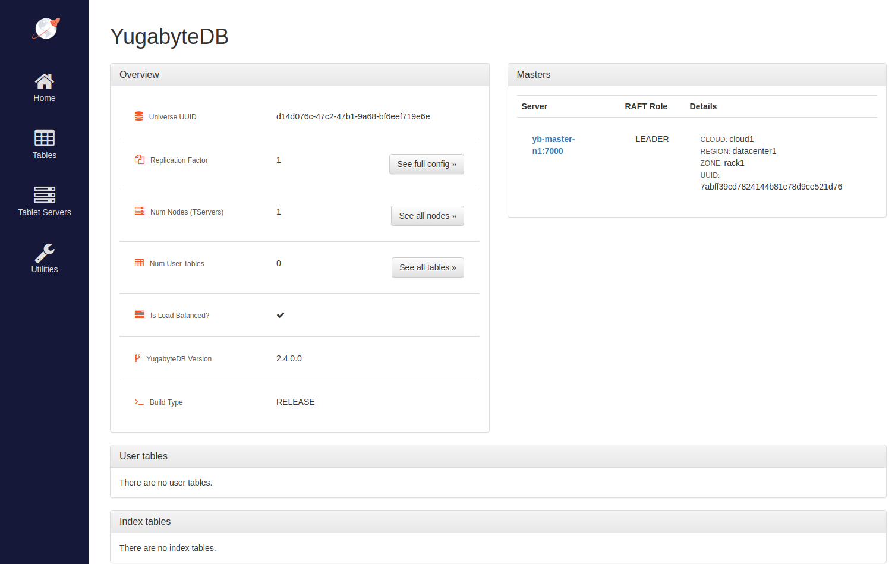

Database benchmarking

**Table of Contents**
- [CockroachDB](#cockroachdb)
- [FoundationDB](#foundationdb)
- [Yugabyte](#yugabyte)
- [Tarantool](#tarantool)

# CockroachDB
[[Site](https://www.cockroachlabs.com)]
[[Docs](https://www.cockroachlabs.com/docs/stable/)]
[[Local install](https://www.cockroachlabs.com/docs/stable/install-cockroachdb-linux.html)]
[[GitHub](https://github.com/cockroachdb/cockroach)]
[[DockerHub](https://hub.docker.com/r/cockroachdb/cockroach/tags?page=1&ordering=last_updated)]

Linux distro: any

1. Pull: `docker pull cockroachdb/cockroach:v20.2.4`
2. Run on port 26257:

```
docker run -it                      \
    --name cockroachdb              \
    --memory=1g                     \
    --cpus=1                        \
    -p 26257:26257 -p 8080:8080     \
    cockroachdb/cockroach:v20.2.4   \
    start-single-node               \
     --insecure
```
Web-UI: http://localhost:8080


3. Links: 
* [Start a Cluster in Docker](https://www.cockroachlabs.com/docs/v20.2/start-a-local-cluster-in-docker-linux)
4. Monitoring:
* http://localhost:8080/_status/vars

# FoundationDB
[[Site](https://www.foundationdb.org)]
[[Docs](https://apple.github.io/foundationdb/)]
[[Download deb/rpm](https://www.foundationdb.org/download/)]
[[GitHub](https://github.com/apple/foundationdb)]
[[DockerHub](https://hub.docker.com/r/foundationdb/foundationdb/tags?page=1&ordering=last_updated)]

Linux distro: CentOS 7 / Ubuntu 12.04 or later

1. Pull: `docker pull foundationdb/foundationdb:6.3.10`
2. Run on port 4500:
```
docker run -it                          \
    --name foundationdb                 \
    --memory=1g                         \
    --cpus=1                            \
    -p 4500:4500                        \
    foundationdb/foundationdb:6.3.10
```
3. Links: 
* [Python sample using docker-compose](https://github.com/apple/foundationdb/tree/master/packaging/docker/samples/python)
* [Awesome-foundationdb](https://github.com/FoundationDB/awesome-foundationdb)
4. Monitoring:
* `TODO` https://github.com/aikoven/foundationdb-exporter

# Yugabyte
[[Site](https://www.yugabyte.com/platform/)]
[[Docs](https://docs.yugabyte.com)]
[[Local install](https://docs.yugabyte.com/latest/quick-start/install/linux/)]
[[GitHub](https://github.com/yugabyte/yugabyte-db)]
[[DockerHub](https://hub.docker.com/r/yugabytedb/yugabyte/tags?page=1&ordering=last_updated)]

Linux distro: CentOS 7 / Ubuntu 16.04 or later

1. Pull: `docker pull yugabytedb/yugabyte:2.4.0.0-b60`
2. Run on port 5433:
```
docker run -it                              \
    --memory=1g                             \
    --cpus=1                                \
    -p 5433:5433                            \
    yugabytedb/yugabyte:2.4.0.0-b60         \
    /home/yugabyte/bin/yb-tserver           \
    --fs_data_dirs=/mnt/tserver             \
    --start_pgsql_proxy                     \
    --rpc_bind_addresses=localhost:9100     \
    --tserver_master_addrs=localhost:7100
```
3. Run a single node cluster on port cql=9042, sql=5433 (more about ports [here](https://docs.yugabyte.com/latest/reference/configuration/default-ports/)):
* `docker-compose.yaml`
```YAML
---
version: '2'

volumes:
  yb-master-data-1:
  yb-tserver-data-1:

services:
  yb-master:
      image: yugabytedb/yugabyte:2.4.0.0-b60
      container_name: yb-master-n1
      volumes:
      - yb-master-data-1:/mnt/master
      command: [ "/home/yugabyte/bin/yb-master",
                "--fs_data_dirs=/mnt/master",
                "--master_addresses=yb-master-n1:7100",
                "--rpc_bind_addresses=yb-master-n1:7100",
                "--replication_factor=1"]
      ports:
      - "7000:7000"
      environment:
        SERVICE_7000_NAME: yb-master

  yb-tserver:
      image: yugabytedb/yugabyte:2.4.0.0-b60
      container_name: yb-tserver-n1
      volumes:
      - yb-tserver-data-1:/mnt/tserver
      command: [ "/home/yugabyte/bin/yb-tserver",
                "--fs_data_dirs=/mnt/tserver",
                "--start_pgsql_proxy",
                "--rpc_bind_addresses=yb-tserver-n1:9100",
                "--tserver_master_addrs=yb-master-n1:7100"]
      ports:
      - "9042:9042"
      - "5433:5433"
      - "9000:9000"
        mem_limit: 1g
        cpus: 1
      environment:
        SERVICE_5433_NAME: ysql
        SERVICE_9042_NAME: ycql
        SERVICE_6379_NAME: yedis
        SERVICE_9000_NAME: yb-tserver
      depends_on:
      - yb-master
```
* `docker-compose up -d`

Web-UI: http://localhost:7000


4. Links:
* [Create a single node cluster](https://docs.yugabyte.com/latest/deploy/docker/docker-compose/#1-create-a-single-node-cluster)
* [Benchmark](https://docs.yugabyte.com/latest/benchmark/)
5. Monitoring:
* Worker: http://localhost:7000/prometheus-metrics
* Master: http://localhost:9000/prometheus-metrics

# Tarantool
[[Site](https://www.tarantool.io/)]
[[Docs](https://www.tarantool.io/en/doc/latest/)]
[[Install](https://www.tarantool.io/en/doc/latest/getting_started/getting_started_db/)]
[[GitHub](https://github.com/tarantool/tarantool)]
[[DockerHub](https://hub.docker.com/r/tarantool/tarantool/tags?page=1&ordering=last_updated)]

Linux distro: CentOS 6 or later / Ubuntu 16.04 or later

1. Pull: `docker pull tarantool/tarantool:2.6.2`
2. Run on port 3301: 
```
docker run -it                              \
  --name tarantool                          \
    --memory=1g                             \
    --cpus=1                                \
  -p 3301:3301                              \
  -v /data/dir/on/host:/var/lib/tarantool   \
  tarantool/tarantool:2.6.2
```
3. Links:
* `TODO`
4. Monitoring:
* `TODO` https://github.com/tarantool/metrics
